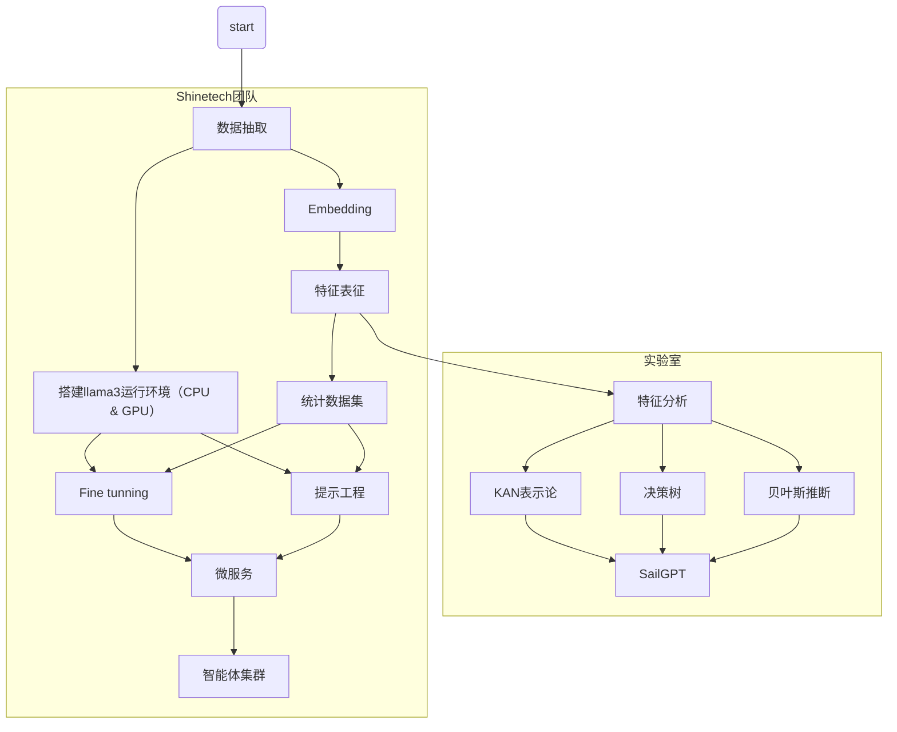

```mermaid
flowchart TD
  start(start) --> database[数据抽取]
  subgraph 实验室
  
  analysis --> kan["KAN表示论"] & dt[决策树] & bayes[贝叶斯推断]
  kan & dt & bayes --> sail["SailGPT"]
  end
  subgraph Shinetech团队
  database --> setup[搭建llama3运行环境（CPU & GPU）] & embedding[Embedding]
  embedding-->feat[特征表征]
  feat --> analysis[特征分析] 
  feat --> dataset[统计数据集]
  setup --> prompt[提示工程] & ft[Fine tunning]
  dataset --> ft & prompt
  ft & prompt --> project["微服务"]
  project --> agents[智能体集群]
  end
```